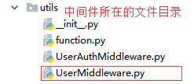
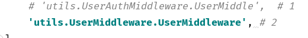

### 登录和注销

---

[TOC]

#### 中间件

-   中间件对 user  的处理
-   最简单的中间件, 还需要完善, 有 BUG , 不能处理 django anomouseuser
-   中间件需要在 settings.py 中注册添加





```python
class UserMiddleware(MiddlewareMixin):

    def process_request(self, request):

        path = request.path
        ignore_path = ['/user/login/', '/user/register/']
        if path in ignore_path:
            return None

        ticket = request.COOKIES.get('ticket')  # 拿到 ticket
        if ticket:
            # 找出用户
            user_ticket = UserTicketModel.objects.filter(ticket=ticket).first()
            # 判断是否过期, 没过期绑定 user 在request 中
            if user_ticket:
                if datetime.utcnow() < user_ticket.out_time.replace(tzinfo=None):
                    # 绑定 user 在 request 中
                    request.user = user_ticket.user
```


#### 登录

python

```python
def login(request):
    """
    登录
    """
    if request.method == 'GET':
        return render(request, 'user/user_login.html')
    if request.method == 'POST':
        username = request.POST.get('username')
        password = request.POST.get('password')
        user = UserModel.objects.filter(username=username).first()
        ticket = create_ticket()
        # 将相应提取出来, 等待绑定 ticket 后返回
        resopnse = HttpResponseRedirect(reverse('axf:mine'))
        # 设置过期时间
        out_time = datetime.now() + timedelta(days=1)
        # 用户是否存在  验证密码
        if user and check_password(password, user.password):
            # 保存 ticket 得到用户, 已近存在于表中就只更新 ticket 和 过期时间
            user_t = UserTicketModel.objects.get_or_create(user_id=user.id)[0] # 得到的是个 tuple 需要取值
            # 数据库保存 用户的 ticket,out_time
            user_t.ticket = ticket
            user_t.out_time = out_time
            user_t.save()
            # 将ticket 绑定在 响应 中
            resopnse.set_cookie('ticket', ticket, expires=out_time)
            return resopnse
```

html

```html
 <form method="post" action=""> <!-- onsubmit="return check_input()"-->
            
            <div class="form-group">
                <label for="exampleInputEmail1">用户</label>
                <input type="text" name="username" class="form-control" placeholder="用户名">
            </div>
            <div class="form-group">
                <label for="exampleInputPassword1">密码</label>
                <input id="password" type="password" name="password" class="form-control" placeholder="密码">
            </div>
            <input type="submit" class="btn btn-success btn-block" value="登录">
        </form>
```

js

```javascript

```


#### 注销


python

```python
def logout(request):
    """
    退出登录
    """
    if request.method == 'GET':
        # 删除 cookies 中的ticket
        response = HttpResponseRedirect(reverse('axf:mine'))
        response.delete_cookie('ticket')
        # 删除 UserTicket 中的 ticket
        return response

```


#### Models

```python
class UserModel(models.Model):
    """用户"""
    username = models.CharField(max_length=32, unique=True)
    password = models.CharField(max_length=25)
    email = models.CharField(max_length=64, unique=True)
    sex = models.BooleanField(default=False) # False 女 True 男
    icon = models.ImageField(upload_to='icons')  # 头像
    is_delete = models.BooleanField(default=False) # False 未删除, True 删除

    class Meta:
        db_table = 'axf_users'

    def __str__(self):
        return self.username


class UserTicketModel(models.Model):
    """用户 ticket"""
    user = models.ForeignKey(UserModel) # 关联用户
    ticket = models.CharField(max_length=256) # 密码
    out_time = models.DateTimeField() # 过期时间

    class Meta:
        db_table = 'axf_users_ticket'

    def __str__(self):
        return self.user.username
```

