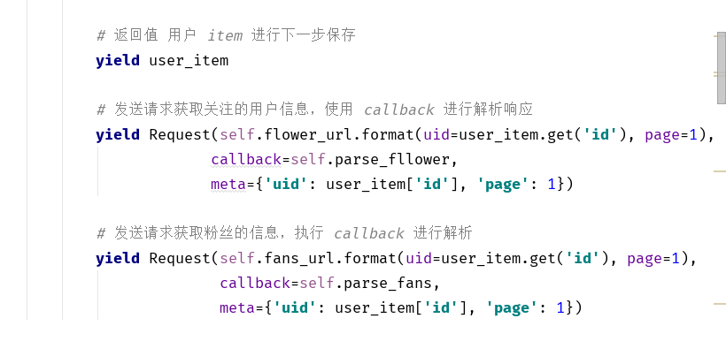

### 爬取微博博主的关注和粉丝


-   用于获取新浪微博的用户的用户关注的对象， 还有用户的粉丝


##### 个人信息接口分析

```shell
# 个人用户的信息 完整接口
https://m.weibo.cn/api/container/getIndex?
uid=1696587952
&luicode=10000011
&lfid=100103type%3D3%26q%3D%E9%AA%86%E6%98%8A%26t%3D0
&featurecode=20000320
&type=all
&containerid=1005051696587952

# 整理接口 简化
https://m.weibo.cn/api/container/getIndex?
uid=1195242865
&containerid=1005051195242865

```

关注接口

```shell

# 完整接口
https://m.weibo.cn/api/container/getIndex?
containerid=231051_-_followers_-_1263498570
&luicode=10000011
&lfid=1076031263498570
&featurecode=20000320
&type=all
&page=2

# 简化接口
https://m.weibo.cn/api/container/getIndex?
containerid=231051_-_followers_-_1263498570
&page=2


```


粉丝详情接口

```shell

uid = 1263498570

# 完整接口
https://m.weibo.cn/api/container/getIndex?
containerid=231051_-_fans_-_1263498570
&luicode=10000011
&lfid=1076031263498570
&featurecode=20000320
&since_id=2

# 简化接口
https://m.weibo.cn/api/container/getIndex?
containerid=231051_-_fans_-_1263498570
&since_id=2  # 页码

```


compare对比文件软件， 对比文件的不同


### 代码介绍

首先需要创建一个 spider 项目 weibo.py，通过继承scrapy.Spider来重写内部的方法，实现爬取需要的内容。


weibo.py

```python

start_requests(self)
定义开始的请求地址，开始获取网页信息，通过 scrapy.Request(url, callback=func),来进行获取顶一个网页

scray 采用的 Twinsty 异步请求的框架， 会将 Request 中的请求放在消息队列中等待执行
```

在函数中，通过 yield 来进行等待执行，通过每次讲请求放在 请求队列中 等待执行 实现异步获取数据




items.py

定义数据模型，需要哪些字段来进行获取对应字段的数据， 在返回的时候都是返回这里的 item 对象， 相当于models


 pipelines.py

用于最后的存储数据作用，在这里存储数据可以避免数据的混乱，有序进行数据的插入

同时还需要判断 传入的 Item 是 那个 Item  模型， 由于每个 Item 都会在每个 Pipeline对象中传入， 使用 isinstance() 函数来 确保数据插入到对应的 数据库或者表格中


settings.py

真个 scrapy 框架的 一些设置都在这里， 可以在这里设置默认的 USER-AGENT，middleware等， 通过打开 pipeline使存储数据的管道生效。

[settings.py功能介绍](https://github.com/zhangMingLu/Learning-notes/blob/master/10-spider/scrapy/%E5%85%B3%E4%BA%8Esetting.py%E7%9A%84%E5%8F%82%E6%95%B0.md)


middleware.py

设置中间键，例如可以设置 user-agent 中间键来给每次的请求中添加不同的 user-agent 来避免反爬，还可以设置代理 IP 来放置反爬。